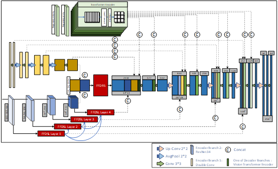

# LFFTNet

Wang, Yuefei and Song, Haojie and Yu, Xi and Yang, Yixi and Wang, Xilei and Xu, Yuqyan and Feng, Ronghui and Yu, Xiaodong. (2023) . LFFT Net: A Layered Feature Fusion and Vision Transformer Combined "Dual Encoding-Mixed Decoding" Semantic Segmentation Model.

Semantic segmentation, a technique used to identify and classify objects within an image, has the potential to greatly assist medical professionals in accurately extracting numerous lesions quickly, thereby facilitating clinical diagnosis. To address challenges such as difficult lesion extraction and low segmentation accuracy, we propose a novel approach called multi-level layered semantic fusion. Departing from the limitations of traditional U-shaped structures, we incorporate the attention mechanism of Transformer ViT and develop a "Dual Encoding-Mixed Decoding" model as the foundational architecture for our research. To achieve feature fusion across different semantic levels and resolution scales, we introduce two modules: Feature Fusion Module for Different Semantic Levels (FFDSL) and Feature Fusion Module with Different Resolution Scales (FFDRS). These modules mitigate the issue of feature segregation at Skip Connection and Bottleneck, respectively, and enable semantic flattening of the conventional U structure. Through extensive experimentation on three types of medical datasets with 15 comparative models and 12 ablation structures, we demonstrate the superior performance of our proposed network across eight evaluation indicators.

## Main components

### dataset.py

------

The guidelines for data preprocessing.

### LFFTNet.py

------

The specific implementation of the methodology in this paper.

### train.py

------

The details of training method and hyperparameters.

### utils

------

The loader, indicators and their calculation methodology.

### requirements

------

The detailed description of the experimental environment.

## Usage

Run Train.py after preparing the dataset.
